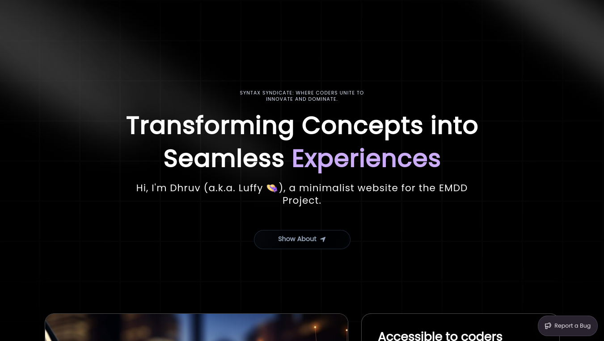
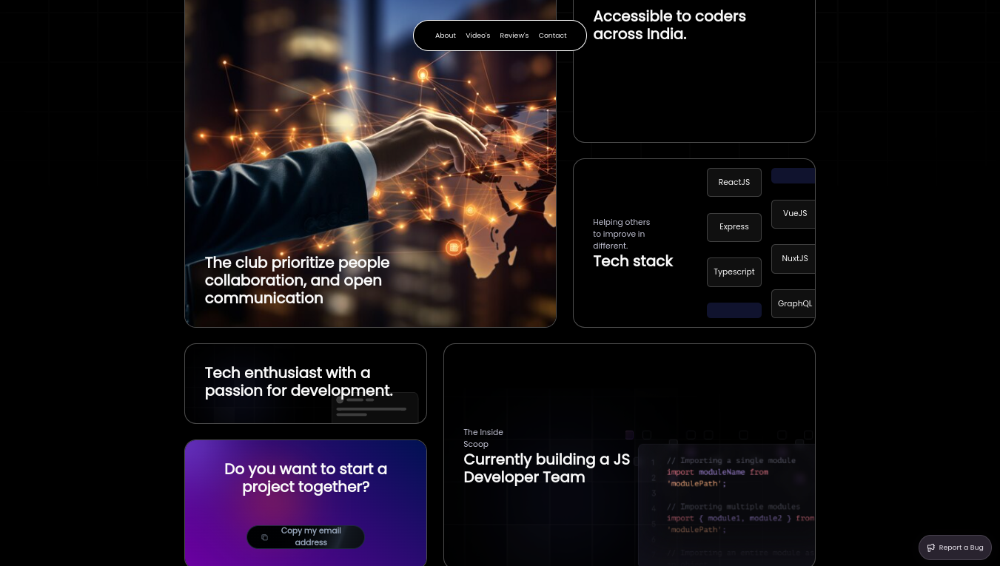
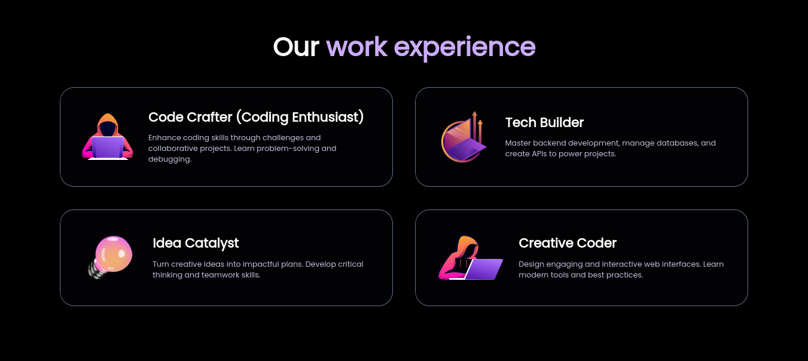
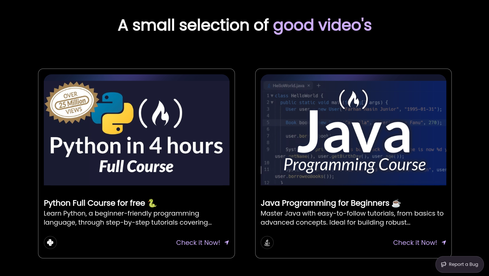
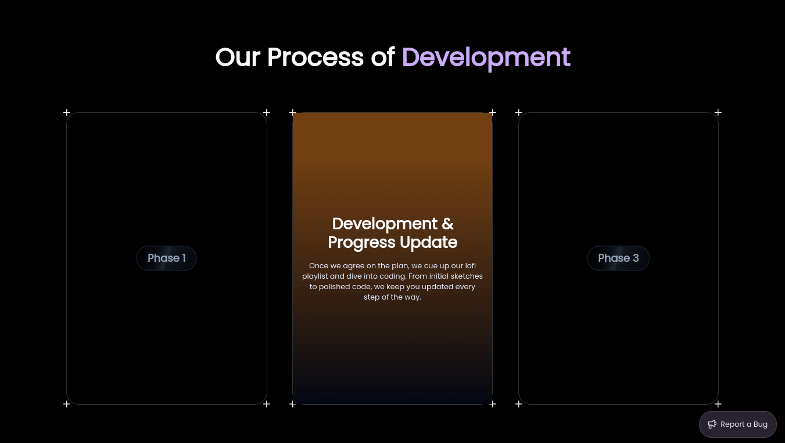
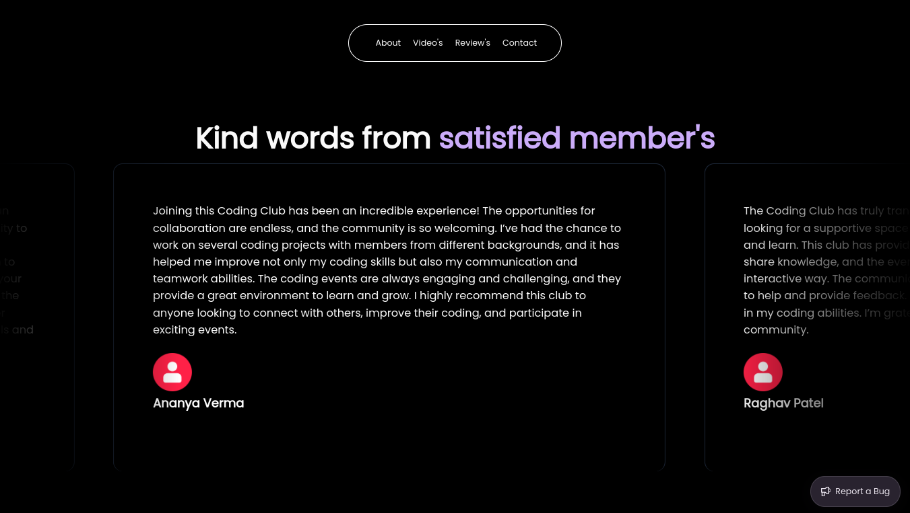
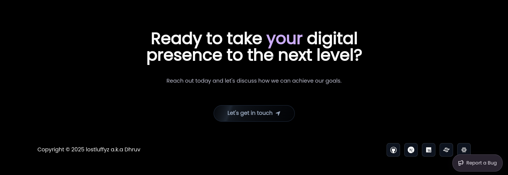

# 🌟 My Awesome Next.js Project



> 🚀 A modern web application built with **Next.js**, **TypeScript**, and **TailwindCSS**. 

## ✨ Features

- 🔥 **Next.js** for Server-Side Rendering and Static Site Generation.
- ⚡ **TypeScript** for robust and type-safe code.
- 🎨 **TailwindCSS** for rapid and responsive styling.
- 💻 Fully responsive and optimized for performance.

---

## 🌐 Live Demo

Check out the live version of the website here: [Deployed Website Link](#https://syntaxsyndicate.vercel.app/)

---

## 📂 Project Structure

```plaintext
├── components     # Reusable UI components
├── pages          # Next.js pages
├── public         # Static assets (images)
├── styles         # TailwindCSS styles
├── utils          # Utility functions
├── tsconfig.json  # TypeScript configuration
└── package.json   # Dependencies and scripts
```

---

## 🛠️ Installation and Usage

Follow these steps to set up the project locally:

### Prerequisites

- Node.js v16+ ([Download Here](https://nodejs.org))
- npm or yarn package manager

### Installation

```bash
# Clone the repository
$ git clone https://github.com/your-username/your-repo-name.git

# Navigate to the project folder
$ cd your-repo-name

# Install dependencies
$ npm install
# or
$ yarn install
```

### Running the Development Server

```bash
# Start the development server
$ npm run dev
# or
$ yarn dev

# Open your browser at http://localhost:3000
```

### Building for Production

```bash
# Build the project
$ npm run build
# or
$ yarn build

# Start the production server
$ npm start
# or
$ yarn start
```

---

## 🌈 Customization

To customize the project:

- Edit styles in `./tailwind.config.ts`.
- Modify components in `./components`.
- Update page content in `./app/page.tsx`.

---

## 📸 Screenshots














---

## 🤝 Contribution

Contributions are welcome! To contribute:

1. Fork the repository
2. Create a feature branch (`git checkout -b feature-name`)
3. Commit your changes (`git commit -m 'Add some feature'`)
4. Push to the branch (`git push origin feature-name`)
5. Create a Pull Request

---

## 📬 Contact

If you have any questions, feel free to reach out:

- GitHub: [lostluffyz](https://github.com/lostluffyz)
- Email: dhruvjha.dhairya0@gmail.com

---

## 🌟 Show Your Support

If you like this project, please give it a ⭐ on GitHub and share it with others! 😊
